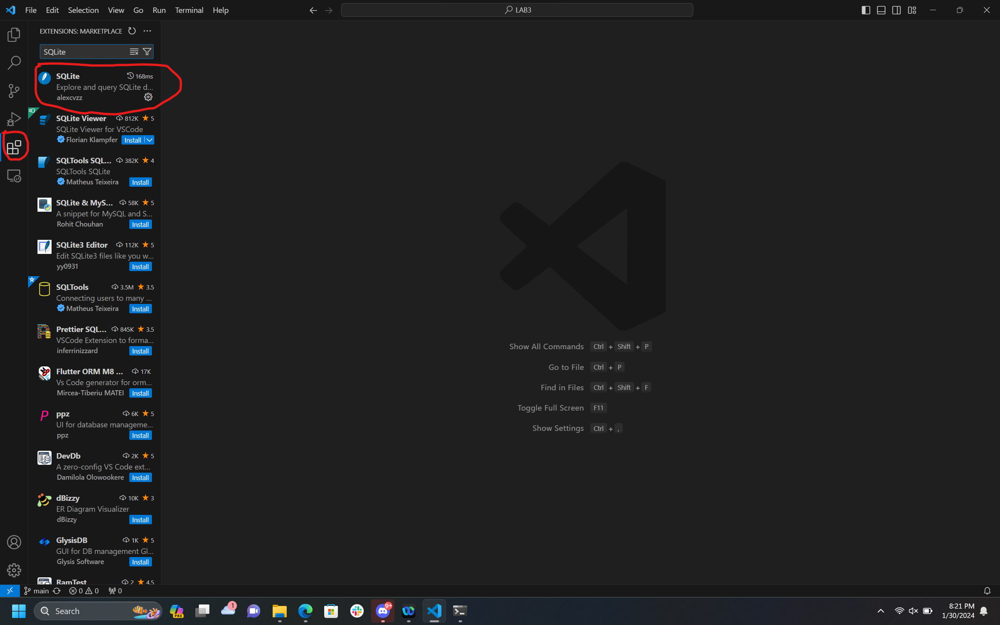
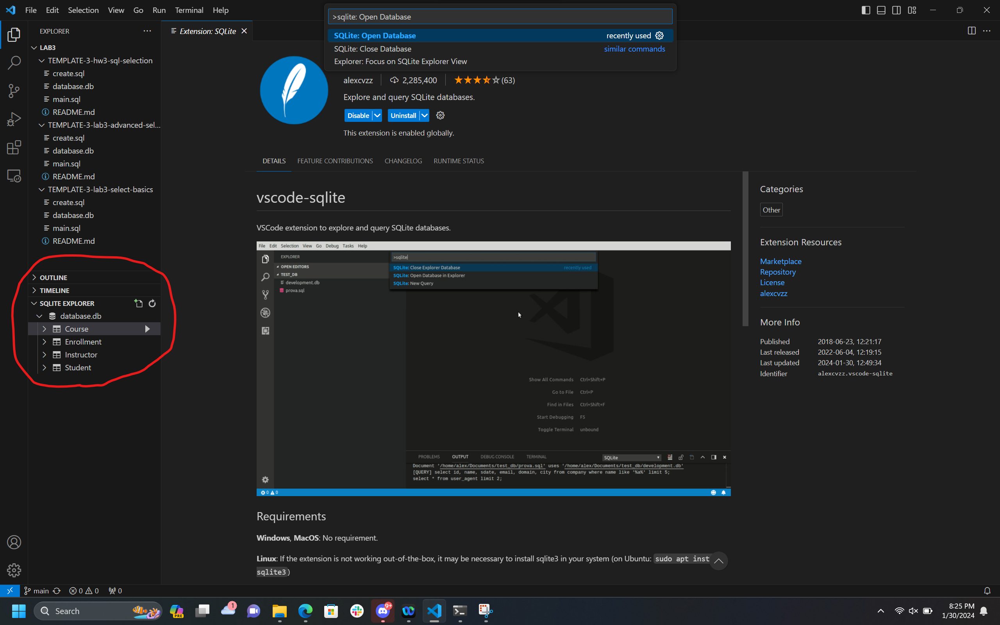
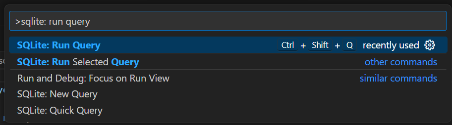
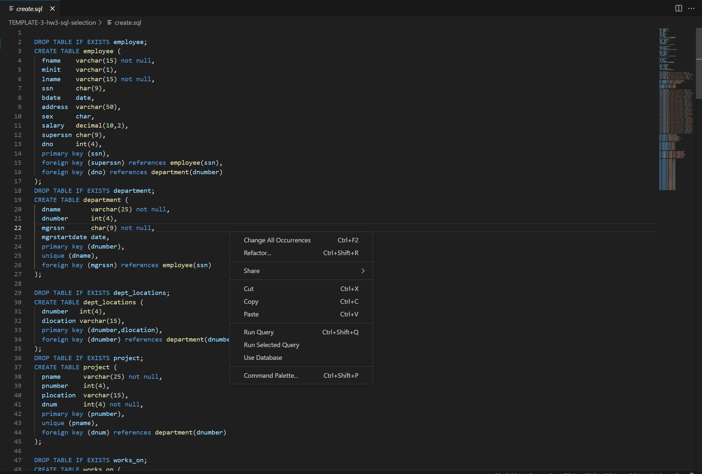
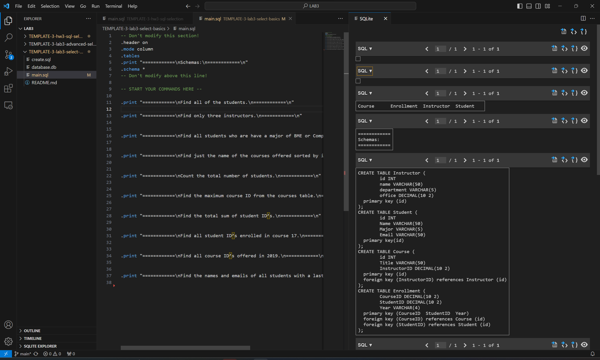
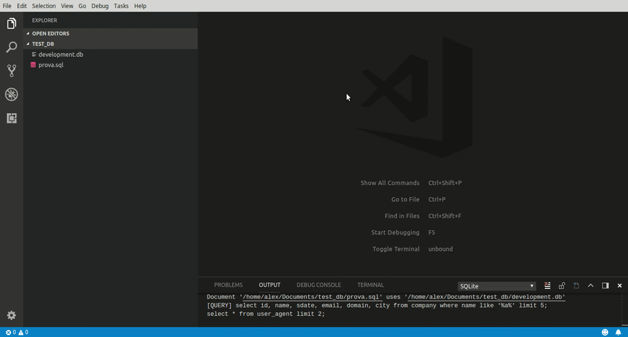

# SQLite Instructions

Install the SQLite extension in VSCode:



While the extension page addresses how to use this extension, we'll go over some key features that we will be using. That being said, we recommend reading this over to familiarize yourself with understanding developer pages.

You can download the:

- [Database](database.db)
- [DDL database SQL](create.sql)
- [The start of a DML file of queries](main.sql)

You'll want to download these and place these where the sqlite extension can see them.
Note, at this point, you don't need to write any queries.
That's what the lab is for!

# Selecting a database

To select a database, you'll want to type ```>sqlite: Open Database``` in the top search bar of VSCode.

When this is done, you'll be able to view a new menu towards the bottom left of your editor:



# Running a query

Now that the extension is installed and a database is selected, you can run your ```.sql``` files. To do this, make sure the file you would like to run is open and selected. Then, you can choose to run the ```>sqlite: Run Query``` command in the top search bar:



Or you can simply right click in the window, and choose ```Run Query```:


Once the query is run, a panel should open up to display the output of the query. Take for example this query I ran for the Select Basics lab:




# Notes

Make sure that when you are running queries that you are in the correct database. Otherwise, you may see incorrect results pop up.


# Animated Example

See the following animated example of selecting a database and running a query:

